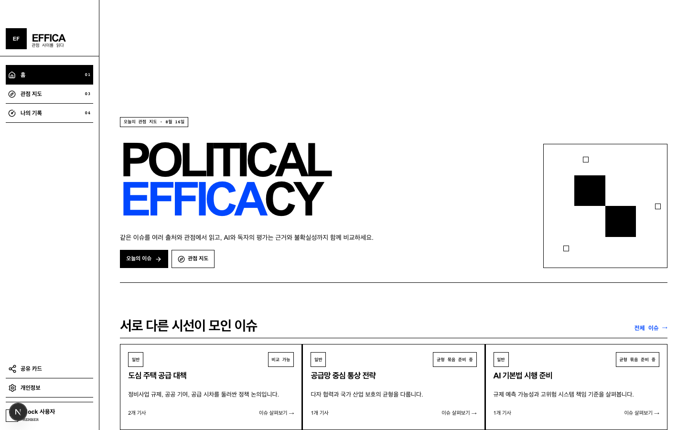
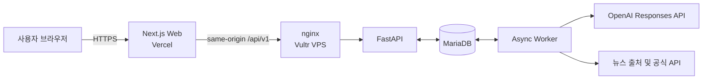

# EFFICA

### 관점 사이를 읽다

같은 이슈를 여러 출처와 관점에서 비교하고, 
AI 분석과 독자의 판단을 함께 보여주는 **정치 뉴스 큐레이션 플랫폼**

[**서비스 바로가기**](https://www.effica.forum) | [**발표 자료**](docs/SLIDES.pdf) | [**데모 영상**](docs/DEMO_VIDEO.mp4) | [**API 명세**](client/src/lib/api/generated/openapi.json)

[서비스 소개](#about) | [핵심 기능](#features) | [이용 흐름](#experience) | [아키텍처](#architecture) | [기술 스택](#tech-stack)

---

## 왜 EFFICA인가요?

관심사 중심 추천은 익숙한 관점만 반복해서 보여주기 쉽습니다. EFFICA는 정치 뉴스를 단순히 소비하는 데서 멈추지 않고, **같은 이슈를 다룬 서로 다른 기사와 프레이밍을 비교하며 스스로 판단하는 경험**으로 바꿉니다.

서비스 이름은 정치적 효능감을 뜻하는 **Political Efficacy**에서 출발했습니다. 정반대의 관점을 강요하는 대신, 현재 관점과 가깝지만 다른 기사부터 자연스럽게 탐색하도록 돕는 것이 EFFICA의 방향입니다.

> EFFICA는 AI 점수를 정답처럼 제시하지 않습니다. 분석 근거, 신뢰도, 독자 평가와 변경 이력을 함께 공개해 판단의 맥락을 제공합니다.

## 핵심 기능

| 기능 | 경험 |
| --- | --- |
| **이슈 중심 뉴스 탐색** | 여러 출처의 기사를 동일 이슈로 묶어 프레이밍과 강조점의 차이를 한눈에 비교합니다. |
| **설명 가능한 AI 분석** | 기사별 편향성과 과장성뿐 아니라 분석 근거와 신뢰도, 버전 정보를 함께 보여줍니다. |
| **다양성 보정 피드** | 사용자가 덜 본 출처와 보완 관점을 우선하며, 각 기사의 추천 이유를 표시합니다. |
| **독자 참여 평가** | 독자의 투표와 읽기 행동을 분석 결과에 연결해 일방적인 AI 판정을 보완합니다. |
| **나의 관점 지도** | 설문과 서비스 내 활동을 바탕으로 관점 변화를 시각화하고 공유 카드로 만들 수 있습니다. |
| **운영 관리 도구** | 뉴스 출처와 수집 정책을 설정하고 AI 분석과 점수 가중치를 관리합니다. |

## 서비스 이용 흐름

1. **오늘의 이슈를 발견합니다.** 관심도만이 아니라 관점 다양성을 고려한 이슈와 기사를 만납니다.
2. **같은 사건의 다른 시선을 비교합니다.** 출처, 편향성, 과장성, 분석 신뢰도를 함께 살펴봅니다.
3. **직접 읽고 평가합니다.** 기사 원문을 확인하고 자신의 판단을 투표로 남깁니다.
4. **관점의 변화를 확인합니다.** 읽기 기록과 효능감 변화를 시각화하고 선택적으로 공유합니다.

## 아키텍처

- 웹은 **Vercel**, API와 비동기 워커 및 MariaDB는 **Vultr VPS**에서 분리 운영합니다.
- 브라우저 요청은 Vercel의 same-origin `/api/v1/*` rewrite를 거쳐 Vultr의 TLS API로 전달됩니다.
- 기사 수집, 정규화, 이슈 군집화, LLM 분석처럼 재시도가 필요한 작업은 MariaDB 기반 비동기 워커가 처리합니다.
- LLM 호출에는 시간 제한, 제한된 재시도, 속도 제어, 회로 차단, 출력 스키마 검증과 민감 정보 마스킹을 적용합니다.

## 기술 스택

| 영역 | 기술 |
| --- | --- |
| Web | Next.js 16, React 19, TypeScript, Base UI, TanStack Query, React Three Fiber |
| API | Python 3.12, FastAPI, Pydantic, SQLAlchemy, Alembic |
| Data & Worker | MariaDB 10.6+, asyncmy, MariaDB-backed job queue |
| AI | OpenAI Responses API, 동적 모델과 reasoning 설정, 구조화된 출력 검증 |
| Auth | Google OAuth, opaque session, CSRF protection |
| Quality | Pytest, Ruff, Mypy, Vitest, Playwright, axe-core |
| Infrastructure | Vercel, Vultr VPS, nginx, TLS, SSH tunnel |

## 데이터 보관

기사는 최근 7일을 보관하며 매일 한국시간 오전 4시 10분에 자동 정리합니다.
투표나 읽기 기록 등 사용자 활동에 연결된 기사는 기록 보존을 위해 예외로 남깁니다.
사이트에 필요한 정규화 본문과 분석 결과를 저장하며 수집 원본과 AI 원본 응답은 저장하지 않습니다.
감사로그를 생성하지 않고 중복 실행 방지에 필요한 최소 기록만 유지합니다.
완료 작업과 수집 실행 기록도 7일 후 정리합니다.

실행과 검증은 `.ops/run.sh`, 배포는 `.ops/deploy.sh`를 사용합니다.
운영 서버 연결은 `.env`의 `VULTR_IPV4_PUBLIC_ADDRESS`와 `VULTR_PASSWORD`를 사용합니다.
정리 코드와 배포용 서비스 정의는 저장소에서 관리합니다.
상세 보관 기준과 백업 절차는 [데이터 보관 정책](server/db/ARTICLE_RETENTION.md)을 참고하세요.

## Team EFFICA

| 이름 | 역할 |
| --- | --- |
| 배석현 | Build, Team Lead |
| 김준호 | Build |
| 곽아영 | Insight |

**더 많이 읽는 것보다, 다르게 읽는 것.**

