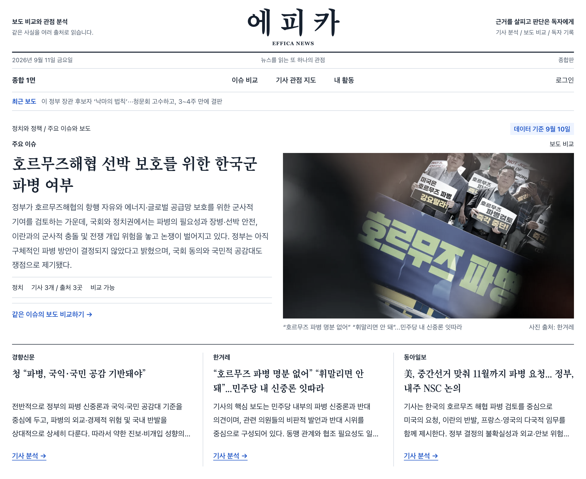
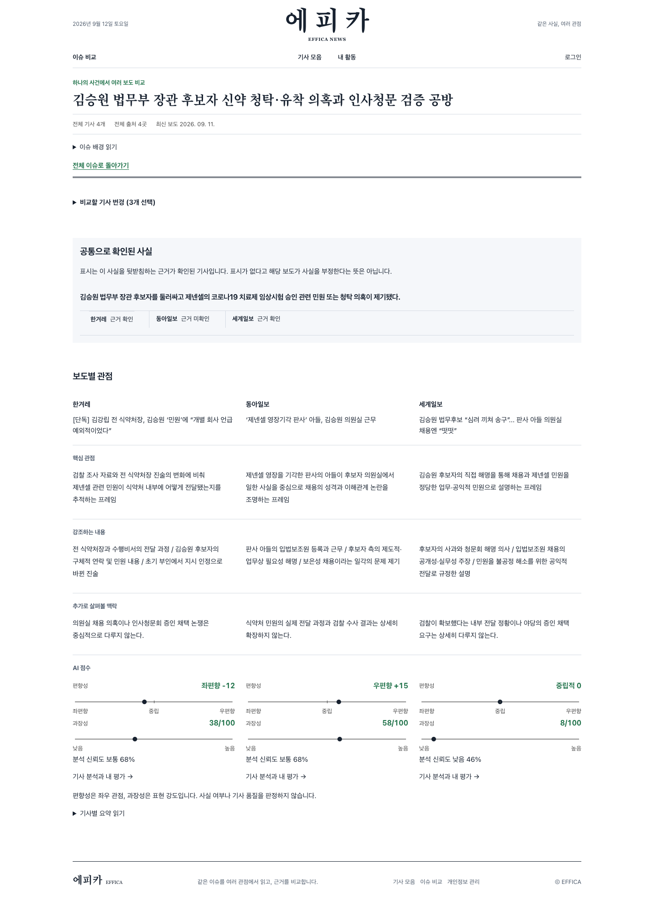
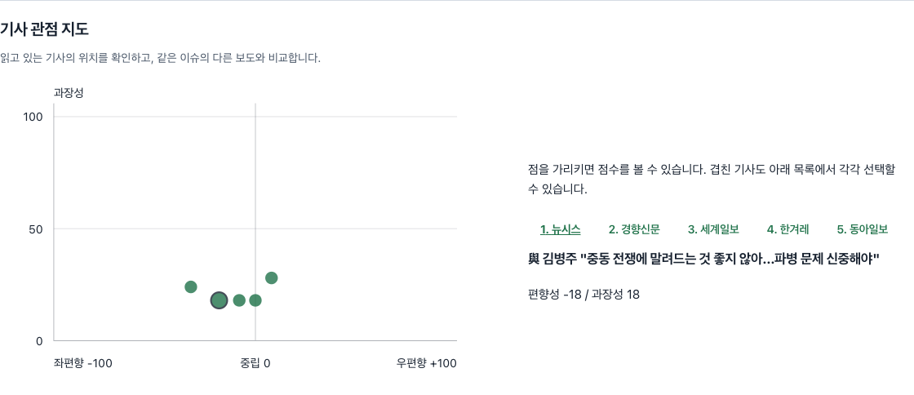

# EFFICA

### Read between perspectives.

**One issue. Many perspectives. Your judgment.**

Compare coverage of the same event side by side. 
Explore the context through AI analysis and reader perspectives.

 

**[Explore EFFICA ↗](https://www.effica.forum)**

[About](#about) | [Compare Coverage](#compare) | [Perspective Map](#perspective) | [Reader Participation](#participation) | [Team](#team)

A starting point for discovering different perspectives on the same issue.

---

## A wider view of the news

The same event can read differently depending on which facts lead the story and whose voices are included. Those differences can be difficult to notice when we keep returning to familiar sources.

EFFICA is a **news comparison platform that connects coverage from different sources around a shared issue**. Readers can examine common facts, compare what each article emphasizes, and explore the context it leaves out. AI helps surface those differences, while readers consult the evidence and original reporting to form their own judgments.

The name comes from **Political Efficacy**: the sense that we can understand political and social issues and make informed judgments for ourselves. That is the experience EFFICA aims to support.

## 01 / Read the same event side by side

Choose **two to four articles from different sources** covering one issue. Start with the facts they share, then explore each article's framing and AI analysis in the same view.

Start with shared facts. See where the coverage diverges.

**See what is emphasized and what is left out.** Look beyond differences in headlines to understand what each article gives weight to. Follow the available evidence and links to original reporting to examine the context behind the analysis.

**Compare AI analysis with reader assessments.** Each is labeled separately, making it possible to see where interpretations agree and where they differ.

## 02 / Explore perspectives in three dimensions

The **Perspective Map** places article analyses in a shared 3D space. Explore clusters of similar coverage and articles that stand apart, then select a point to inspect its analysis.

From the overall distribution to an individual article, connected through a single selection.

| Map dimension | What it shows |
| :--- | :--- |
| **Horizontal / Political bias** | Where an article's claims and emphasis fall along a left-to-right political spectrum |
| **Height / Sensationalism** | How provocative or emotionally charged the headline and wording are |
| **Depth / Analysis confidence** | How stable the AI assessment is given the available evidence |

Switch between individual articles and source averages to explore the distribution. Compare a selected article with the overall article average, then use the charts below to examine each dimension. When a personal perspective profile is available, articles closer to that profile's political bias appear first in the list.

## 03 / Bring your own judgment

Readers can contribute assessments as well as explore the analysis. Read the original reporting, record your judgment, and reflect on your reading and comparison activity.

- **Understand why an article was recommended.** Each recommendation explains its purpose, such as offering a nearby perspective or complementary coverage of the same issue.
- **Compare your stated perspective with your reading activity.** Survey responses and perspectives inferred from activity are presented separately.
- **Reflect on how your understanding changes.** Review the articles you have read and the sources you have encountered. Track your confidence in understanding political issues and optionally create a card to share your perspective profile.

---

## Make the evidence and its limits visible

**Explain what the scores mean.** Political bias describes the direction of an article's perspective. Sensationalism describes the intensity of its language. Neither determines factual accuracy or article quality. Analysis confidence is distinct from source credibility or the probability that a claim is true.

**Show the evidence available to readers.** Readers can check whether supporting evidence is public and review the history of score revisions. EFFICA displays the status when analysis is still being prepared or does not meet its publication criteria.

**Create room for different perspectives.** Exploration can begin with articles close to a familiar viewpoint and continue toward other sources and complementary coverage. The final interpretation belongs to the reader.

## Team EFFICA

| Name | Role |
| :--- | :--- |
| Johnny SeokHyun Bae | Build, Team Lead |
| Junho Kim | Build |
| Ayoung Kwak | Insight |

 

**Read more perspectives. See more of the story.**

[Read between perspectives with EFFICA ↗](https://www.effica.forum)

