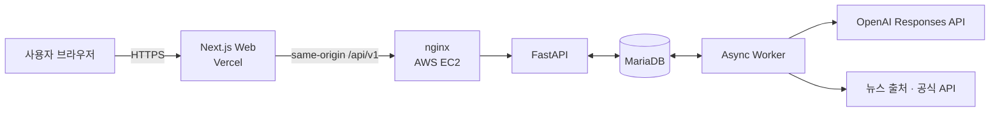

<div align="center">

# EFFICA

### 관점 사이를 읽다

같은 이슈를 여러 출처와 관점에서 비교하고,<br />
AI 분석과 독자의 판단을 함께 보여주는 **정치 뉴스 큐레이션 플랫폼**

[](https://nextjs.org/)
[](https://react.dev/)
[](https://www.typescriptlang.org/)
[](https://fastapi.tiangolo.com/)
[](https://mariadb.org/)
[](https://platform.openai.com/docs/api-reference/responses)

[**서비스 바로가기**](https://effica.vercel.app) | [**발표 자료**](PPT_VIDEO/25-EFFICA.pdf) | [**API 명세**](apps/web/src/lib/api/generated/openapi.json)

</div>


<div align="center">

[서비스 소개](#about) · [핵심 기능](#features) · [이용 흐름](#experience) · [아키텍처](#architecture) · [기술 스택](#tech-stack) · [시작하기](#getting-started)

</div>

---

<a id="about"></a>

## 왜 EFFICA인가요?

관심사 중심 추천은 익숙한 관점만 반복해서 보여주기 쉽습니다. EFFICA는 정치 뉴스를 단순히 소비하는 데서 멈추지 않고, **같은 이슈를 다룬 서로 다른 기사와 프레이밍을 비교하며 스스로 판단하는 경험**으로 바꿉니다.

서비스 이름은 정치적 효능감을 뜻하는 **Political Efficacy**에서 출발했습니다. 정반대의 관점을 강요하는 대신, 현재 관점과 가깝지만 다른 기사부터 자연스럽게 탐색하도록 돕는 것이 EFFICA의 방향입니다.

> EFFICA는 AI 점수를 정답처럼 제시하지 않습니다. 분석 근거, 신뢰도, 독자 평가와 변경 이력을 함께 공개해 판단의 맥락을 제공합니다.

<a id="features"></a>

## 핵심 기능

| 기능 | 경험 |
| --- | --- |
| **이슈 중심 뉴스 탐색** | 여러 출처의 기사를 동일 이슈로 묶어 프레이밍과 강조점의 차이를 한눈에 비교합니다. |
| **설명 가능한 AI 분석** | 기사별 편향성·과장성뿐 아니라 분석 근거와 신뢰도, 버전 정보를 함께 보여줍니다. |
| **다양성 보정 피드** | 사용자가 덜 본 출처와 보완 관점을 우선하며, 각 기사의 추천 이유를 표시합니다. |
| **독자 참여 평가** | 독자의 투표와 읽기 행동을 분석 결과에 연결해 일방적인 AI 판정을 보완합니다. |
| **나의 관점 지도** | 설문과 서비스 내 활동을 바탕으로 관점 변화를 시각화하고 공유 카드로 만들 수 있습니다. |
| **운영 관리 도구** | 출처·수집 정책·분석 작업·LLM 모델·점수 가중치를 관리하고 모든 변경에 감사 기록을 남깁니다. |

<a id="experience"></a>

## 서비스 이용 흐름

1. **오늘의 이슈를 발견합니다.** 관심도만이 아니라 관점 다양성을 고려한 이슈와 기사를 만납니다.
2. **같은 사건의 다른 시선을 비교합니다.** 출처, 편향성, 과장성, 분석 신뢰도를 함께 살펴봅니다.
3. **직접 읽고 평가합니다.** 기사 원문을 확인하고 자신의 판단을 투표로 남깁니다.
4. **관점의 변화를 확인합니다.** 읽기 기록과 효능감 변화를 시각화하고 선택적으로 공유합니다.

<a id="architecture"></a>

## 아키텍처



- 웹은 **Vercel**, API·비동기 워커·MariaDB는 **AWS EC2**에서 분리 운영합니다.
- 브라우저 요청은 Vercel의 same-origin `/api/v1/*` rewrite를 거쳐 EC2의 TLS API로 전달됩니다.
- 기사 수집, 정규화, 이슈 군집화, LLM 분석처럼 재시도가 필요한 작업은 MariaDB 기반 비동기 워커가 처리합니다.
- LLM 호출에는 시간 제한, 제한된 재시도, 속도 제어, 회로 차단, 출력 스키마 검증과 민감 정보 마스킹을 적용합니다.

<a id="tech-stack"></a>

## 기술 스택

| 영역 | 기술 |
| --- | --- |
| Web | Next.js 16, React 19, TypeScript, Base UI, TanStack Query, React Three Fiber |
| API | Python 3.12, FastAPI, Pydantic, SQLAlchemy, Alembic |
| Data & Worker | MariaDB 10.6+, asyncmy, MariaDB-backed job queue |
| AI | OpenAI Responses API, 동적 모델·reasoning 설정, 구조화된 출력 검증 |
| Auth | Google OAuth, opaque session, CSRF protection |
| Quality | Pytest, Ruff, Mypy, Vitest, Playwright, axe-core |
| Infrastructure | Vercel, AWS EC2, nginx, TLS, SSH tunnel |

<a id="getting-started"></a>

## 로컬에서 시작하기

### 준비 사항

- Python 3.12+
- Node.js 22 LTS와 npm
- [`uv`](https://docs.astral.sh/uv/)
- `ssh`, `sshpass`
- 접근 가능한 EC2 및 MariaDB 환경

로컬 개발에서도 별도의 MariaDB를 띄우지 않습니다. 실행 스크립트가 EC2 내부 MariaDB로 SSH 터널을 열며, FastAPI는 `127.0.0.1:8000`, Next.js는 `127.0.0.1:3000`에서 실행됩니다.

### 1. 환경 변수 설정

```bash
cp .env.example .env
chmod 600 .env
```

루트 `.env`의 placeholder를 실제 값으로 교체하세요. 서비스별 환경 파일을 따로 만들지 않으며, Google이 유일한 사용자 로그인 제공자입니다.

주요 설정은 다음과 같습니다.

| 설정 | 설명 |
| --- | --- |
| `DATABASE_URL` | EC2의 MariaDB 연결 URL. 실행 중에만 로컬 SSH 터널 주소로 치환됩니다. |
| `GOOGLE_CLIENT_ID`, `GOOGLE_CLIENT_SECRET` | Google OAuth 자격 증명 |
| `LLM_PROVIDER_MODE` | `auto`, `stub`, `live` 중 선택 |
| `OPENAI_API_KEY` | live 분석에 사용하는 OpenAI API 키 |
| `LLM_TIMEOUT_SECONDS` | OpenAI 분석 요청 제한 시간(초). 기본값 `180`, 최대 `300` |
| `LLM_MAX_RETRIES` | provider 내부 재시도 수. durable queue가 재시도하므로 기본값 `0` |
| `WORKER_MAX_CONCURRENCY` | 동시에 처리할 비동기 작업 수. 기본값 `4` |
| `WORKER_SHUTDOWN_GRACE_SECONDS` | 배포 종료 시 진행 중 호출을 마칠 유예 시간. 실 LLM에서는 `LLM_TIMEOUT_SECONDS + 10` 이상이어야 하며 기본값 `195`초 |
| `WORKER_CRAWL_INTERVAL_SECONDS` | 승인된 활성 출처를 다시 수집하는 주기. 기본값 `900`초 |
| `WORKER_CRAWL_BATCH_SIZE` | 수집 주기마다 예약할 최대 출처 수. 기본값 `50` |
| `DB_TUNNEL_PORT` | 기본값 `13306`; 포트 충돌 시 변경 |

### 2. 통합 개발 서버 실행

```bash
./.ops/run.sh start
```

의존성 동기화, DB 터널 연결, Alembic migration, FastAPI와 Next.js 실행을 한 번에 처리합니다. 루트의 임의 `run.sh`가 아니라 위 스크립트가 공식 실행 진입점입니다.

### 3. 자주 사용하는 명령

```bash
# 전체 품질 게이트
./.ops/run.sh verify

# 백엔드 테스트
./.ops/run.sh test

# OpenAPI 계약 검증
./.ops/run.sh openapi

# 비동기 워커 실행
./.ops/run.sh worker

# DB 연결 확인 / migration / seed
./.ops/run.sh check-db
./.ops/run.sh migrate
./.ops/run.sh seed
```

`LLM_PROVIDER_MODE=stub`은 네트워크 없이 결정론적인 분석을 수행합니다. 기본값인 `auto`는 `OPENAI_API_KEY`가 있으면 live 분석을, 없으면 offline 분석을 사용합니다. live 모드의 활성 모델과 reasoning effort는 관리자 API에서 변경할 수 있습니다. 워커는 MariaDB advisory lock과 수집 주기별 dedupe key를 사용해 여러 프로세스가 실행되어도 승인된 출처를 한 번씩만 예약합니다. 예약 RSS는 메타데이터 우선으로 수집하고 최근 72시간의 승인 출처 기사를 함께 비교해 출처 간 사건 후보를 만들며, 단일 기사·단일 출처 묶음은 이슈로 저장하지 않습니다.

## 프로젝트 구조

```text
effica/
├── apps/
│   ├── web/          # Next.js 사용자·관리자 웹
│   ├── api/          # FastAPI와 도메인 서비스
│   └── worker/       # 수집·분석·집계를 처리하는 비동기 워커
├── db/               # Alembic migration과 seed
├── docs/             # 설계 결정과 문서 자산
├── tests/            # 통합·운영 계약 테스트
└── .ops/             # 공식 실행, 검증, 배포 진입점
```

## 배포

프로덕션의 정식 주소는 [https://effica.vercel.app](https://effica.vercel.app)입니다.
GitHub Actions와 Git 연동 자동 배포는 사용하지 않습니다. 실행과 검증은 `.ops/run.sh`,
배포는 `.ops/deploy.sh`만 공식 진입점으로 사용합니다.

```bash
./.ops/deploy.sh
```

배포 스크립트는 사전 검증, MariaDB 백업, EC2 atomic release, Vercel 배포와 배포 후 health check를 순서대로 수행합니다. Next.js는 Vercel에서만 서비스하며 EC2에서는 실행하지 않습니다. 프로덕션 시작은 MariaDB, HTTPS origin, 정확한 Google callback URL과 OAuth 자격 증명이 모두 유효하지 않으면 중단됩니다.

## Team EFFICA

| 이름 | 역할 |
| --- | --- |
| 배석현 | Build · Team Lead |
| 김준호 | Build |
| 곽아영 | Insight |

<div align="center">

**더 많이 읽는 것보다, 다르게 읽는 것.**

</div>
